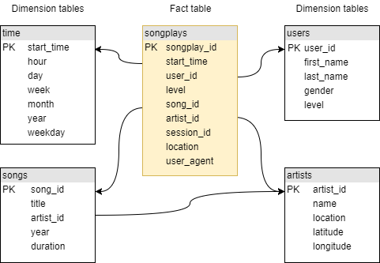

# ETL & Cloud Data Warehouse in AWS

> **Stephanie Anderton**
> DEND Project #3
> May 29, 2019

## Sparkify Songplay Data Warehouse

A music streaming startup, Sparkify, wants to move their processes and data onto the cloud. Their data resides in S3, in a directory of JSON logs on user activity in the Sparkify music streaming app, as well as a directory with JSON metadata on the songs in their app.

This ETL pipeline will load their data from S3 to the staging tables on Redshift, and transform the data into a set of dimensional tables for their analytics team to continue finding insights in what songs their users are listening to.

## Datasets

The two datasets reside in S3:

- Song data: `s3://udacity-dend/song_data`
- Log data: `s3://udacity-dend/log_data`

Log data JSON path: `s3://udacity-dend/log_json_path.json`

### Song Dataset

The song dataset consists of files in JSON format, each containing metadata about a single song and the artist of that song. The files are partitioned in subdirectories, organized by the first three letters after `TR` of each song's track ID. For example, these are the file paths for two files in this dataset.

```
song_data/A/B/C/TRABCAJ12903CDFCC2.json
song_data/A/B/A/TRABAVQ12903CBF7E0.json
```

Here is an example of what a single song file, TRABCAJ12903CDFCC2.json, looks like in JSON format.

```json
{"num_songs": 1, "artist_id": "ARULZCI1241B9C8611", "artist_latitude": null, "artist_longitude": null, "artist_location": "", "artist_name": "Luna Orbit Project", "song_id": "SOSWKAV12AB018FC91", "title": "Midnight Star", "duration": 335.51628, "year": 0}
```

### Log Dataset

The log dataset consists of files in JSON format, each containing metadata about event activity in the music streaming app. These files are partitioned in subdirectories, organized by year and month. For example, these are two files in this dataset.

```
log_data/2018/11/2018-11-12-events.json
log_data/2018/11/2018-11-13-events.json
```

Here is an example of what the first line of data (a single event record in JSON format) looks like in the file labelled 2018-11-23-events.json.

```json
{"artist":"Great Lake Swimmers","auth":"Logged In","firstName":"Kevin","gender":"M","itemInSession":0,"lastName":"Arellano","length":215.11791,"level":"free","location":"Harrisburg-Carlisle, PA","method":"PUT","page":"NextSong","registration":1540006905796.0,"sessionId":815,"song":"Your Rocky Spine","status":200,"ts":1542931645796,"userAgent":"\"Mozilla\/5.0 (Macintosh; Intel Mac OS X 10_9_4) AppleWebKit\/537.36 (KHTML, like Gecko) Chrome\/36.0.1985.125 Safari\/537.36\"","userId":"66"}
...
```

**Note**: Only log records with `page` feature as “NextSong” are associated with song plays and loaded to the final database.

## DB Schema

The **sparkify** data model is essentially a star schema (or a minimal snowflake schema because of the relationship between songs and artists), and is implemented in a Postgres database on Redshift. It contains one fact table of songplays and four dimension tables for users, songs, artists, and time.





This schema is not fully normalized, as the `level` feature is replicated in the songplays fact table as well as the users dimension table. It’s structure will allow queries to be optimized for song play analysis, with simpler joins and aggregations. All essential data for songplays and user level is contained in the songplays fact table.

## ETL Pipeline

The ETL pipeline extracts data from directories in S3, stages them on Redshift, and then transforms and loads the data into the five tables of the **sparkify** database. This is handled by three files written in Python and SQL.

| Step  | File             | Purpose                                                      |
| ----- | ---------------- | ------------------------------------------------------------ |
| **1** | create_tables.py | Creates and initializes the staging tables and final dimensional tables for the **sparkify** database. |
| **2** | etl.py           | Reads and processes files from the song_data and log_data directories on S3, and loads them into the **sparkify** database tables. |
| -     | sql_queries.py   | Contains all SQL queries. This file is imported into create_tables.py and etl.py. |
| \*    | mylib.py         | Library with methods for logging events during the ETL process. |

\* *Additional code, not part of the project requirements.*

## Steps to Run the ETL

In a terminal, run the following commands to create (or reset) the tables in the **sparkify** database and to process the datasets:

1. **python create_tables.py**
2. **python etl.py**,

The following is an example of the commands and output generated when running the scripts.

```bash
steph@STEPH-LAPTOP MINGW64 ~/Udacity/DEND/PROJECT_3/ETL-Cloud-Data-Warehouse (master)
$ python create_tables.py
Logfile :  ./logs/etl-20190529.log
host=dwhcluster.cbsjbxldkge8.us-west-2.redshift.amazonaws.com dbname=sparkify user=dwhuser password=Passw0rd port=5439
(base)
steph@STEPH-LAPTOP MINGW64 ~/Udacity/DEND/PROJECT_3/ETL-Cloud-Data-Warehouse (master)
$ python etl.py
Logfile:  ./logs/etl-20190529.log
host=dwhcluster.cbsjbxldkge8.us-west-2.redshift.amazonaws.com dbname=sparkify user=dwhuser password=Passw0rd port=5439
Load Staging tables...
Insert into Final tables...
Check table counts...
(base)
steph@STEPH-LAPTOP MINGW64 ~/Udacity/DEND/PROJECT_3/ETL-Cloud-Data-Warehouse (master)
$
```

## Logfile Output

### Starting the Redshift Cluster

```
09:42:08 AM :  ===[  Inititate Cluster  ]===
09:42:08 AM :  2019-05-29  09:42:08 AM
09:42:09 AM :  DWH_CLUSTER_TYPE:  multi-node
09:42:09 AM :  DWH_NUM_NODES:  4
09:42:09 AM :  DWH_NODE_TYPE:  dc2.large
09:42:09 AM :  DWH_CLUSTER_IDENTIFIER:  dwhCluster
09:42:09 AM :  DWH_REGION:  us-west-2
09:42:09 AM :  HOST:  dwhcluster.cbsjbxldkge8.us-west-2.redshift.amazonaws.com
09:42:09 AM :  DB_NAME:  sparkify
09:42:09 AM :  DB_USER:  dwhuser
09:42:09 AM :  DB_PASSWORD:  Passw0rd
09:42:09 AM :  DB_PORT:  5439
09:42:09 AM :  IAM_ROLE_NAME:  dwhRole
09:42:09 AM :  IAM_POLICY_ARN:  arn:aws:iam::aws:policy/AmazonS3ReadOnlyAccess
09:42:09 AM :  ARN:  'arn:aws:iam::376450510082:role/dwhRole'
09:42:09 AM :  Creating a new IAM Role
09:42:10 AM :  New IAM Role ARN:  arn:aws:iam::376450510082:role/dwhRole
09:42:11 AM :  Create cluster successful
09:42:12 AM :  ClusterIdentifier:  dwhcluster
09:42:12 AM :  NodeType:  dc2.large
09:42:12 AM :  ClusterStatus:  creating
09:42:12 AM :  MasterUsername:  dwhuser
09:42:12 AM :  DBName:  sparkify
09:42:12 AM :  VpcId:  vpc-aa278fd2
09:42:12 AM :  NumberOfNodes:  4
09:48:15 AM :  ClusterStatus:  available
09:48:15 AM :  time to spin cluster:  6 minutes
09:48:15 AM :  HOST:  dwhcluster.cbsjbxldkge8.us-west-2.redshift.amazonaws.com
09:48:15 AM :  ARN:   arn:aws:iam::376450510082:role/dwhRole
09:48:16 AM :  Opened TCP port on cluster endpoint
09:48:17 AM :  host=dwhcluster.cbsjbxldkge8.us-west-2.redshift.amazonaws.com dbname=sparkify user=dwhuser password=Passw0rd port=5439
09:48:17 AM :  connected to database:  sparkify
09:48:17 AM :  Ready for ETL...
```

### Create Tables & ETL
```
05:28:16 PM :  ---[ Create Tables ]---
05:28:16 PM :  2019-05-29  05:28:16 PM
05:28:17 PM :  DB connection :  open
05:28:17 PM :  Drop existing tables...
05:28:17 PM :  delete table [ staging_events ]
05:28:17 PM :  delete table [ staging_songs ]
05:28:18 PM :  delete table [ songplays ]
05:28:18 PM :  delete table [ users ]
05:28:18 PM :  delete table [ songs ]
05:28:18 PM :  delete table [ artists ]
05:28:19 PM :  delete table [ time ]
05:28:19 PM :  Create tables...
05:28:19 PM :  create table [ staging_events ]
05:28:19 PM :  create table [ staging_songs ]
05:28:20 PM :  create table [ songplays ]
05:28:20 PM :  create table [ users ]
05:28:20 PM :  create table [ songs ]
05:28:21 PM :  create table [ artists ]
05:28:21 PM :  create table [ time ]
05:28:21 PM :  DB connection :  closed
05:29:24 PM :  ---[ Begin ETL ]---
05:29:24 PM :  2019-05-29  05:29:24 PM
05:29:24 PM :  LOG_DATA:  's3://udacity-dend/log_data'
05:29:24 PM :  LOG_JSONPATH:  's3://udacity-dend/log_json_path.json'
05:29:24 PM :  SONG_DATA:  's3://udacity-dend/song_data'
05:29:24 PM :  DB connection :  open
05:29:24 PM :  Disable result cache for session
05:29:24 PM :  Load staging tables...
05:29:24 PM :  load staging table [ staging_events ]...
05:29:28 PM :  load staging table [ staging_songs ]...
05:33:12 PM :  Load final tables...
05:33:12 PM :  insert to table [ songplays ]
05:33:12 PM :  insert to table [ users ]
05:33:13 PM :  insert to table [ songs ]
05:33:13 PM :  insert to table [ artists ]
05:33:13 PM :  insert to table [ time ]
05:33:14 PM :  Check table counts...
05:33:14 PM :  table count [ staging_events ] :  8056
05:33:14 PM :  table count [ staging_songs ] :  14896
05:33:15 PM :  table count [ songplays ] :  333
05:33:15 PM :  table count [ users ] :  104
05:33:15 PM :  table count [ songs ] :  14896
05:33:15 PM :  table count [ artists ] :  10025
05:33:16 PM :  table count [ time ] :  6813
05:33:16 PM :  DB connection :  closed
```

## Sample Queries

### Top 10 Songs in songplays

Displays the top 10 most frequently played songs, based on the song ID.

**Note**: some song titles appear more than once if there are multiple versions associated with variations in the artist ID.

```sql
top_10_songs = ("""
    WITH songplays_ext  AS (
             SELECT *
             FROM   songplays
             JOIN   songs
             ON     sp_song_id   = s_song_id
             JOIN   artists
             ON     sp_artist_id = a_artist_id
    )

    SELECT   s_title    AS "song title",
             a_name     AS "artist name",
             COUNT(*) count
    FROM     songplays_ext
    GROUP BY s_title, a_name
    ORDER BY count DESC, s_title
    LIMIT    10;
""")
```

Output:  10 rows

|                                           song title |                    artist name | count |
| ---------------------------------------------------: | -----------------------------: | ----: |
|                                       You're The One |                  Dwight Yoakam |    37 |
| Catch You Baby (Steve Pitron & Max Sanna Radio Edit) |                  Lonnie Gordon |     9 |
|                                  I CAN'T GET STARTED |                     Ron Carter |     9 |
|    Nothin' On You [feat. Bruno Mars] (Album Version) |                          B.o.B |     8 |
|                             Hey Daddy (Daddy's Home) | Usher featuring Jermaine Dupri |     6 |
|                             Hey Daddy (Daddy's Home) |                          Usher |     6 |
|                                         Make Her Say | Kid Cudi / Kanye West / Common |     5 |
|                                         Make Her Say |                       Kid Cudi |     5 |
|                                         Up Up & Away |                       Kid Cudi |     5 |
|                                         Up Up & Away | Kid Cudi / Kanye West / Common |     5 |

The output shows how there is a real need to clean the data; there are many songs that have variations in the artist_id.

### Top 10 Users in songplays

Display the top 10 users based on the total number of songs they have listened to in the app.

```sql
top_10_users = ("""
    WITH songplays_ext AS (
             SELECT sp_session_id, u_first_name, u_last_name, u_user_id
             FROM   songplays
             JOIN   users
             ON     sp_user_id  = u_user_id  AND
                    sp_level    = u_level
        )

    SELECT   DISTINCT( u_first_name || ' ' || u_last_name ) AS "user name",
             u_user_id              AS "user ID",
             COUNT( sp_session_id ) AS "song count"
    FROM     songplays_ext
    GROUP BY "user ID", "user name"
    ORDER BY "song count" DESC
    LIMIT    10;
""")
```

Output:  10 rows

|          user name | user id | song count |
| -----------------: | ------: | ---------: |
|       Chloe Cuevas |      49 |         42 |
|       Kate Harrell |      97 |         32 |
|       Tegan Levine |      80 |         31 |
|       Aleena Kirby |      44 |         21 |
|        Jacob Klein |      73 |         18 |
| Mohammad Rodriguez |      88 |         17 |
|          Lily Koch |      15 |         15 |
|      Layla Griffin |      24 |         13 |
|      Matthew Jones |      36 |         13 |
|   Jacqueline Lynch |      29 |         13 |

Chloe has listened to a total of 42 songs, and Kate a total of 32.

###  ID for user with most songs

Get the user ID for the user who has listened to the most number of songs in the app.

```sql
top_user_id = ("""
    WITH songplays_ext AS (
            SELECT   sp_session_id, u_user_id
            FROM     songplays
            JOIN     users
            ON       sp_user_id = u_user_id  AND
                     sp_level   = u_level
        ),
        session_counts AS (
            SELECT   u_user_id,
                     COUNT( sp_session_id ) AS count
            FROM     songplays_ext
            GROUP BY u_user_id
        ),
        max_session  AS (
            SELECT   MAX(count) AS max_count
            FROM     session_counts
        )

    SELECT  u_user_id AS top_user
    FROM    session_counts
    WHERE   count = ( 
            SELECT   max_count
            FROM     max_session
    );
""")
```

Output:  1 rows

| top_user |
| -------: |
|       49 |

### Top 5 sessions with most songs for Top User (ID = 49)

Display the top 5 sessions with the most number of songs, for the top user with ID = 49, the user who has listened to the most number of songs.

```sql
top_5_sessions_top_user_49 = ("""
    WITH songplays_user AS (
            SELECT  *
            FROM    songplays
            WHERE   sp_user_id  = 49
        ),
        user_sessions AS (
            SELECT  u_first_name, u_last_name, 
                    sp_session_id, sp_start_time, s_title
            FROM    songplays_user
            JOIN    users
            ON      sp_user_id  = u_user_id  AND
                    sp_level    = u_level
            JOIN    songs
            ON      sp_song_id  = s_song_id
        )

    SELECT   (u_first_name || ' ' || u_last_name) AS "user name",
             sp_session_id      AS "session ID",
             (DATE_PART('year', 
                         sp_start_time) || '-' || DATE_PART('month', 
                         sp_start_time) || '-' || DATE_PART('day', 
                         sp_start_time))::date,
             COUNT(s_title)     AS "song count"
    FROM     user_sessions
    GROUP BY sp_session_id, date, "user name"
    ORDER BY "song count" DESC
    LIMIT    5;
""")

```

Output:  5 rows

|    user name | session id |       date | song count |
| -----------: | ---------: | ---------: | ---------: |
| Chloe Cuevas |       1041 | 2018-11-29 |         11 |
| Chloe Cuevas |       1079 | 2018-11-30 |          5 |
| Chloe Cuevas |        816 | 2018-11-21 |          3 |
| Chloe Cuevas |        987 | 2018-11-27 |          2 |
| Chloe Cuevas |       1114 | 2018-11-30 |          2 |

In her longest session, on November 29 in 2018, Chloe listened to 11 songs.